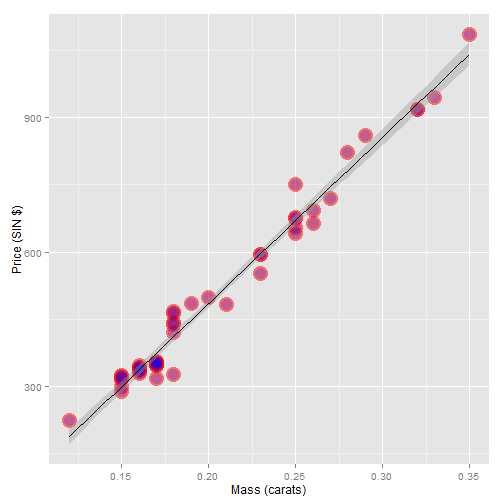

Data Products Project Presentation
========================================================
author: Hugo Cam
date: 1/21/2015

Data Product Coursera


Diamond Price Prediction
========================================================

This project use the diamond data from library UsingR 

It predicts the price of the diamond based on its size

The data set contains 48 diamond rings containing price in Singapore dollars and size of diamond in carats.


Here a summary of the Data
========================================================


```r
library(UsingR)
data(diamond)
summary(diamond)
```

```
     carat           price     
 Min.   :0.120   Min.   : 223  
 1st Qu.:0.160   1st Qu.: 338  
 Median :0.180   Median : 428  
 Mean   :0.204   Mean   : 500  
 3rd Qu.:0.250   3rd Qu.: 657  
 Max.   :0.350   Max.   :1086  
```

Plot of price and mass of diamond and regression line
========================================================

 


Regression Model
========================================================


```r
fit <- lm(price ~ carat, data = diamond)
coef(fit)
```

```
(Intercept)       carat 
     -259.6      3721.0 
```

The model estimates an expected 3721.02 (SIN) dollar increase in price for every carat increase in mass of diamond.
